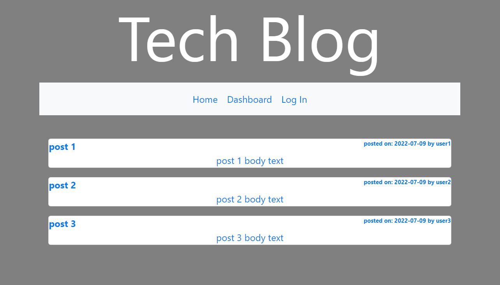

# theTremendousTechBlog

## Table of Contents

- [Description](#description)
- [Installation](#installation)
- [Usage](#usage)
- [Questions](#questions)
- [License](#license)
- [Screenshot](#screenshot)

## Description

This application will require you to login or signup to use or you can only view the posts on the Home pahge. Once you have logged in, you have the option to comment on the post by clicking on the post and entering your comment. You also can go to the dashboard and see your own posts where you can delete them if you want.

## Installation

You can clone the repository from this command:

```bash
git clone https://github.com/Zzaclipse/theTremendousTechBlog.git
```

## Usage

The application can be used from the Heroku deployed page at:

```bash
https://tech-blog-astokes.herokuapp.com/
```

## Questions

What is the developers github?

[Zzaclipse](https://github.com/Zzaclipse)

Where can I reach the developer to ask additional questions?

za.stokes@gmail.com

## License

This application is licened under ISC License

[](https://opensource.org/licenses/ISC)

## Screenshot


